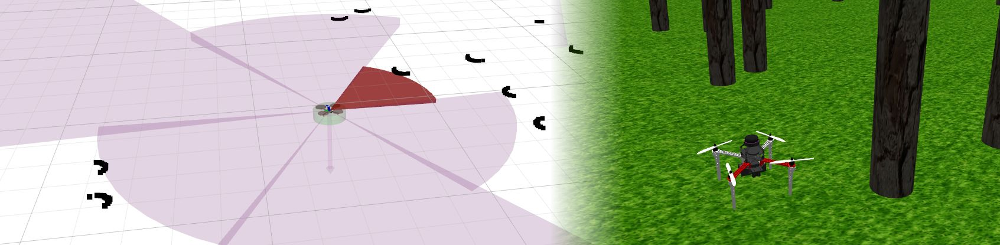

# MRS Bumper
# 

| Build status |  |  |
|--------------|-------------------------------------------------------------------------------------------------------------------------------------|------------------------------------------------------------------------------------------------------------------------------------|

* MRS bumper aggregates data from 1-D, 2-D lidars, and depth-camera images and creates a sector-based representation of the surroundings of a robot.
* It is part of the [uav_core](https://github.com/ctu-mrs/uav_core) repository under the [mrs_uav_system](https://github.com/ctu-mrs/mrs_uav_system).
* The advertised *obstacle sectors* can be visualized in RVIZ and can be used by other ROS nodes in real-time.
* The data is used in the [control manager](https://github.com/ctu-mrs/mrs_uav_managers), for its obstacle bumper.
